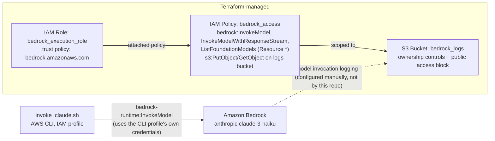

# Bedrock Terraform Infrastructure


Terraform config for setting up basic access to Amazon Bedrock: an IAM policy scoped to `bedrock:InvokeModel` and friends, an S3 bucket to hold model invocation logs, and a role that Bedrock can assume to deliver those logs. There's also a small bash script, `invoke_claude.sh`, that calls Claude 3 Haiku on Bedrock through the AWS CLI, which is how I've actually been testing this - there's no application code here, just infrastructure plus a smoke-test script.

This started as a way to get Bedrock access provisioned repeatably instead of clicking through the console, and to have something scriptable to sanity-check that IAM permissions and model access were set up correctly after each change.

There is a CI pipeline now ([`.github/workflows/ci.yml`](.github/workflows/ci.yml)), but it's a linting/validation gate, not a deploy pipeline: it runs `terraform fmt -check`, `terraform init -backend=false` + `terraform validate`, `shellcheck` against every `.sh` file, and a soft-fail `checkov` static analysis pass. None of that needs AWS credentials and none of it touches real infrastructure - `terraform plan`/`terraform apply` are still run manually from a workstation with the right AWS credentials. That's fine for a single-account personal setup like this; it wouldn't be fine for anything with more than one contributor.

## Architecture



The IAM policy grants `bedrock:InvokeModel` on `Resource = "*"`. Foundation model ARNs are AWS-managed, not customer resources, so this could be tightened to the specific Anthropic model ARNs actually in use (just Claude 3 Haiku, per `invoke_claude.sh`), but I left it wildcarded so I could try other models from the console without touching Terraform. It's a deliberate tradeoff, not an oversight, but it is broader than it needs to be for what's actually being invoked.

The `bedrock_execution_role` is trusted only by `bedrock.amazonaws.com` - it's built for the case where Bedrock itself assumes a role to deliver invocation logs to S3, not for an EC2 instance, Lambda function, or the CLI to assume. In practice, `invoke_claude.sh` doesn't assume this role at all; it calls `bedrock-runtime invoke-model` directly using whatever IAM user/profile is active locally. So the policy and role provisioned here are not actually wired into the one thing in this repo that calls Bedrock - that's a real gap between what's declared and what's used, called out again below. There's also no VPC endpoint for Bedrock; calls go over the public AWS API endpoint, so there's no network-level boundary here, only IAM.

## Known gaps

CI validates and lints, it doesn't deploy: the GitHub Actions workflow runs `terraform fmt -check`, `terraform init -backend=false` + `terraform validate`, `shellcheck` on the shell scripts, and a soft-fail `checkov` scan on every push/PR to `main`. It catches formatting drift, HCL syntax errors, shell script bugs, and flags (but doesn't block on) security findings like the wildcard IAM resource above. It does not run `terraform plan` or `apply`, needs no AWS credentials, and never touches real infrastructure - that part is still manual, by design, for a single-account personal setup.

No remote backend: there's no `backend` block in `main.tf`, so state is local. No locking, no shared state, no history if the local `.tfstate` is lost.

The IAM role and policy aren't actually consumed by `invoke_claude.sh`. The script authenticates with the CLI profile directly; the Terraform-provisioned role/policy pair would only matter if something were configured to assume `bedrock_execution_role` (e.g. Bedrock model invocation logging), and that configuration isn't done here - the code comment in `main.tf` notes logging has to be turned on separately via console or CLI.

`variables.tf` defaults `aws_profile` to `raj-private`, a personal AWS CLI profile name. Anyone else running this needs to override it with `-var` or a `.tfvars` file (the latter is gitignored here on purpose).

The S3 bucket has `force_destroy = true` and no versioning or lifecycle policy, so a `terraform destroy` silently drops any logs in it, and there's no cost control on log growth.

No explicit server-side encryption configuration on the bucket - it relies on S3's account/region defaults rather than a declared KMS or SSE-S3 setting.

## Project structure

```
.
├── .github/workflows/ci.yml  # terraform fmt/validate, shellcheck, checkov (soft-fail)
├── .gitignore          # ignores .terraform/, state files, tfvars, lock file
├── README.md
├── main.tf             # S3 log bucket, IAM policy/role for Bedrock access
├── variables.tf        # region, AWS profile, project name, tags
├── outputs.tf          # role ARN, bucket name, a printed "next steps" block
├── invoke_claude.sh    # AWS CLI smoke test against Claude 3 Haiku on Bedrock
└── claude_prompt.json  # sample request body used when testing manually
```

## How to run this

Prerequisites: an AWS account with model access to Anthropic Claude models requested and approved in the Bedrock console for the target region (this is an AWS-side manual step, Terraform can't do it), the AWS CLI configured with a profile that has permission to create IAM roles/policies and S3 buckets, and Terraform >= 1.0.0.

```bash
terraform init
terraform plan
terraform apply
```

Override the defaults instead of editing `variables.tf` directly, e.g.:

```bash
terraform apply -var="aws_profile=your-profile" -var="aws_region=eu-west-1"
```

To try the Bedrock call once the policy/role exist:

```bash
bash invoke_claude.sh
```

This invokes `anthropic.claude-3-haiku-20240307-v1:0` directly via `aws bedrock-runtime invoke-model` using the profile/region hardcoded near the top of the script (edit those if you're not using `raj-private`/`eu-west-1`), and prints the response text.

To tear down:

```bash
terraform destroy
```
